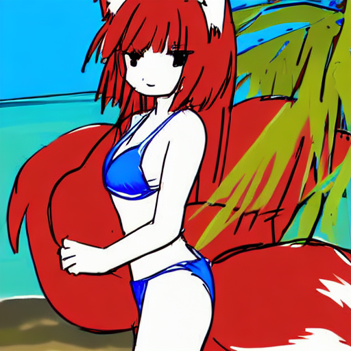
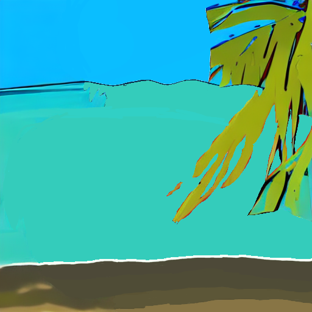
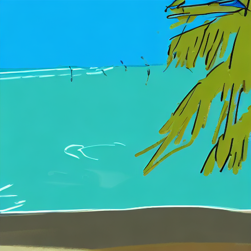
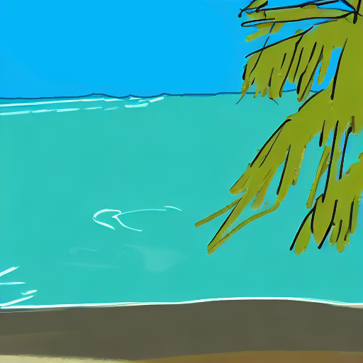
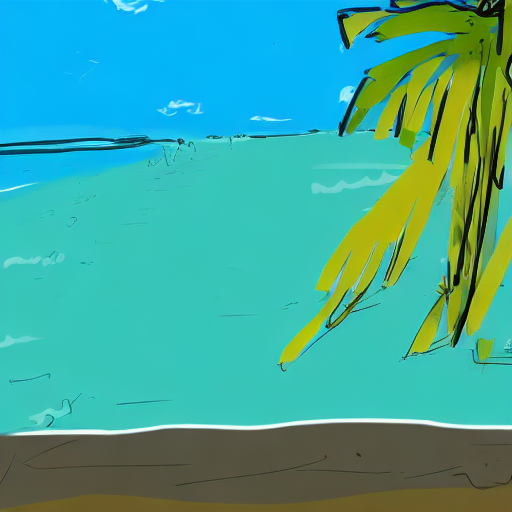
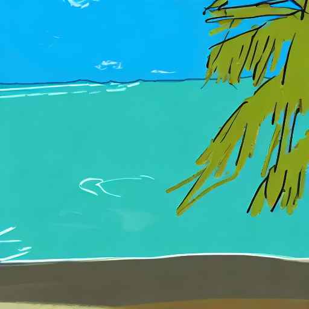
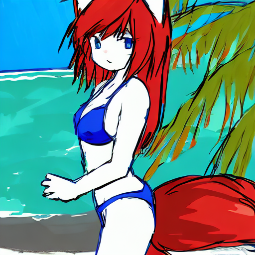
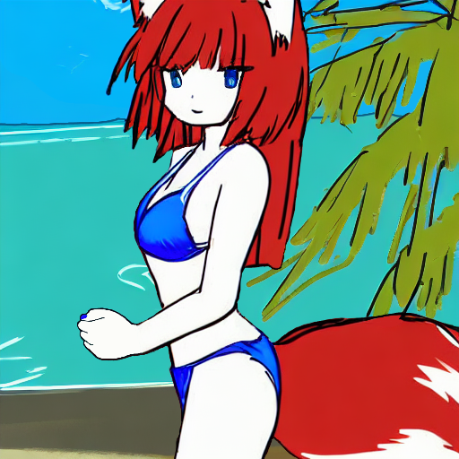
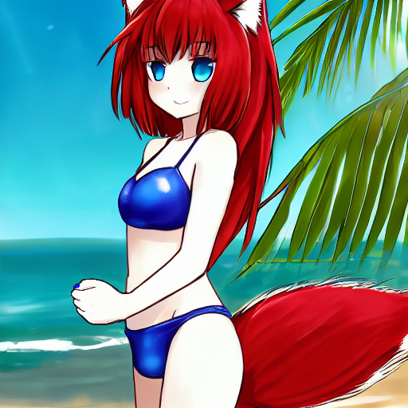

Doubt I'm the first to think of this but I discovered an interesting process to
create artwork with ai that I though I'd jot down. The key idea is instead of
simply trying to generate the image you want, you go though a process of
generate -> edit -> generate -> edit. Lets follow along with how I came to the
image above to get a better idea what I'm talking about.

The first thing I tried was generate what I wanted directly from a prompt.

> 1girl, solo, cute, fox ears, fox tail, red hair, long hair, blue bikini,
beach, key animation, dynamic shot, soft lighting


- seed_729967_00000.png
  A fox girl standing at the beach in a blue bikini with two tails and messed up hands
- seed_882830_00003.png
  A fox girl standing at the beach in a blue bikini with multiple incorrectly placed tails and no arms
- seed_882828_00001.png
  A close-up of a girl at the beach in a blue bikini with some extra hair artifacts behind
- seed_882829_00002.png
  A poorly drawn picture of a fox girl at the beach in a blue bikini standing arkwardly with 3 legs


The results are promising, but none of them are *quite* right. In theory I could
edit one of them to fix it's issues, but they are complicated enough that that
would be very difficult for me to do. So lets step back, what if I created
something I *could* edit instead?

> 1girl, solo, cute, fox ears, fox tail, red hair, long hair, blue bikini,
beach, simple sketch, clean lines

Ok, still not quite right but the style is simple enough that I could work with
it. The first thing I did was break up the foreground from the background.

Lets start with the background first, I removed the extra tails and filled in
those ares with simple colors.

I then fed this back though to get something a bit nicer

> beach, simple sketch, clean lines

Cleaned it up a bit

Ok, clouds would be nice, lets generate that

and paste them in

Ok now for the foreground. I did want some blue eyes so I generated those as well.

> 1girl, solo, cute, fox ears, fox tail, red hair, long hair, blue bikini, gorgeous blue eyes, beach, simple sketch, clean lines

As for the rest of the cleanup, it was quite a bit of work but not too bad. The
hand was the the hardest. Neither me nor stable diffusion seem to be good at
drawing hands 😂.

Finally I ran this though again to up the quality

> 1girl, solo, cute, fox ears, fox tail, red hair, long hair, blue bikini,
gorgeous blue eyes, beach, high detail, soft light

*Sigh*, it messed up the hand again, time to fix.

And there we go! All and all I'm pretty impressed with this process. I was able
to work around stable diffusion's limitations and get exactly what I want with
my limited art skills.